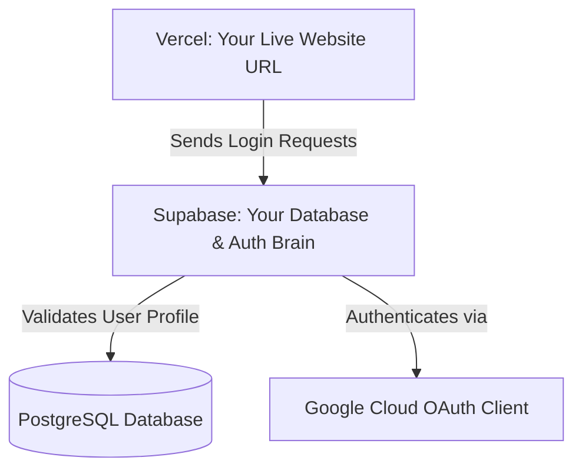

# 🌟 Glowus Beauty - Premium Cosmetics Storefront

Welcome to **Glowus Beauty**, a premium, high-conversion online boutique storefront for premium cosmetics, skin, and hair care! Inspired by modern, luxury cosmetic retail websites, Glowus is designed to capture attention with a beautiful, vibrant design and a fully operational, secure authentication system.

This project is fully connected to a live database backend using **Supabase** (supporting standard email signups and instant **Google Social Login**), and is optimized to run smoothly on **Vercel**!

> [!NOTE]
> **No coding knowledge? No problem!** This guide is designed for absolute beginners. By following the simple steps below, you will have a live, fully functional cosmetics web shop on the internet with a working database and Google sign-in.

---

## ✨ Features That Make Glowus Stand Out

* 💄 **Stunning Luxury Interface**: A premium color scheme featuring deep Royal Blue accents, urgent Golden-Orange action buttons, and beautiful typography.
* 📣 **Infinite Scrolling Announcement Marquee**: An elegant promo ticker at the very top highlighting current offers, complete with a hover-to-pause effect so customers can read deals comfortably.
* 📦 **Real Cosmetic Brand Catalogs**: Pre-loaded shelves featuring bestselling products from top brands like Swiss Beauty, Pilgrim, Mars, Biolage, and Cetaphil.
* 🔒 **Smart Dual-Mode Authentication**:
  * **Live Mode**: Links up instantly with your active Supabase project when keys are configured.
  * **Simulator Mode**: If credentials are not entered, it automatically switches to a high-fidelity local simulator, allowing you to test registration and login straight out of the box using your browser's memory!
* 👁️ **Show/Hide Password Toggle**: Sleek interactive eye toggles inside password inputs so users can see what they type and prevent typos.
* 💾 **Remember Me Feature**: Securely remembers and pre-fills your email address the next time you visit the login screen.
* 💬 **WhatsApp Float Chat**: A floating green badge allowing customers to instantly chat and buy directly through WhatsApp, providing a direct channel to support!

---

## 🚀 Beginner's Launch Guide (Zero Coding Knowledge Required)

Deploying Glowus and setting up your online store is simple. Follow these three steps to get your database, login system, and live website running!

### 🗺️ System Overview: How It All Fits Together



---

### 🗃️ Part 1: Setting Up Your Supabase Database (Your Store's Brain)

**Supabase** is a secure, cloud-based database. Think of it as a digital filing cabinet. Every time a customer signs up, looks at a product, or places an order, it gets stored in a folder inside this cabinet.

1. Go to **[Supabase](https://supabase.com)** and create a free account.
2. Click **New Project** and give it a name (for example, `Glowus Boutique`). Set a secure Database Password and choose a region close to you.
3. Wait about 1-2 minutes for your database to be provisioned.
4. Once ready, look at the left sidebar menu and click on the **SQL Editor** icon (it looks like a `SQL` sheet with a tiny terminal symbol).
5. Click **New Query** (or the **+** button).
6. Open the [schema.sql](file:///c:/Users/shrey/Downloads/lune-beauty-boutique-main/lune-beauty-boutique-main/schema.sql) file located in this project's root folder. Copy all of the text inside it.
7. Paste the copied text into the big white text box in the Supabase SQL Editor.
8. Click the green **Run** button at the top-right of the editor.
   * *What this did:* It instantly created your database tables for customer profiles, products, and shopping orders, seeded your shop with a rich selection of cosmetics, and set up a Postgres trigger to automatically create profiles for new Google signups!

---

### 🔑 Part 2: Activating Google Social Login (Authentication)

This allows your customers to log in securely with their Google Account using the **"Continue with Google"** button on your login page.

1. Go to the **[Google Cloud Console](https://console.cloud.google.com/)**, log in with your Google Account, and create a new project.
2. Search for **APIs & Services** in the search bar and select **OAuth consent screen**.
   * Select **External** and click **Create**.
   * Fill out the App Name (e.g., `Glowus Boutique`) and User Support Email. Click Save and Continue.
3. Navigate to **Credentials** on the left menu.
4. Click **+ Create Credentials** at the top and select **OAuth client ID**.
5. Select **Web application** as the Application Type.
6. Now, go back to your **Supabase Dashboard**, navigate to **Authentication > Providers > Google** on the left sidebar.
7. Enable the Google Provider by toggling it **ON**.
8. Copy the **Redirect URI** shown in your Supabase Google Provider configuration (it looks like `https://your-project-id.supabase.co/auth/v1/callback`).
9. Go back to your Google Cloud OAuth creation page:
   * Scroll down to **Authorized redirect URIs**.
   * Click **Add URI** and paste that copied link from Supabase.
   * Click **Create**.
10. Google will show you a **Client ID** and a **Client Secret**. Copy these values.
11. Return to your Supabase Google Provider configuration page, paste the **Client ID** and **Client Secret** into their respective boxes, and click **Save**.

---

### 🌐 Part 3: Deploying Live Using Vercel (Launch Your Website!)

**Vercel** hosts your website online so anyone in the world can visit it at a secure link. Think of it as a magic billboard. You give it your code, and it displays it to the entire internet!

1. Create a free account on **[Vercel](https://vercel.com/)**.
2. Click the **Add New...** button in the top right and choose **Project**.
3. Import your GitHub repository (e.g., `glowus-makeup-website`).
4. Expand the **Environment Variables** section. This is where you connect your live website to your Supabase database. Add the following two variables:
   * **`NEXT_PUBLIC_SUPABASE_URL`**:
     * *Value:* Copy the **Project URL** from your Supabase Dashboard under **Project Settings > API**.
   * **`NEXT_PUBLIC_SUPABASE_PUBLISHABLE_KEY`**:
     * *Value:* Copy the public **anon** key from your Supabase Dashboard under **Project Settings > API**.
5. Click **Deploy**. Vercel will build and launch your live website in under a minute!
6. **Whitelist your Vercel URL in Supabase so login redirects succeed:**
   * Copy the live website link given to you by Vercel (e.g., `https://your-app.vercel.app`).
   * Go back to your **Supabase Dashboard > Authentication > URL Configuration**.
   * Under **Redirect URLs**, click **Add URL**, paste your Vercel link, and click **Save**.

---

## 💻 Developer Guide (Running on Your Local Machine)

If you are a developer or want to run and edit the website locally on your computer, follow these simple terminal commands.

### Prerequisites
Make sure you have **[Node.js](https://nodejs.org/)** installed on your computer.

### Step 1: Install Dependencies
Open your terminal inside the project directory and run:
```bash
npm install
```

### Step 2: Configure Environment Variables
Create a file named `.env.local` in the root of the project and paste your Supabase keys:
```env
NEXT_PUBLIC_SUPABASE_URL=https://your-project-id.supabase.co
NEXT_PUBLIC_SUPABASE_PUBLISHABLE_KEY=your-anon-publishable-key
```

### Step 3: Run the Development Server
Launch the local server:
```bash
npm run dev
```
Open **[http://localhost:8081](http://localhost:8081)** in your browser. The page will reload automatically as you make changes to the code!

### Step 4: Build for Production
To bundle the project for deployment:
```bash
npm run build
```

---

## 📁 Key Project Files & Folder Map

Here is a simplified directory map to help you navigate and customize the storefront:

* 🗃️ [schema.sql](file:///c:/Users/shrey/Downloads/lune-beauty-boutique-main/lune-beauty-boutique-main/schema.sql) — The blueprint SQL database migration script containing core tables and triggers.
* ⚙️ [vite.config.ts](file:///c:/Users/shrey/Downloads/lune-beauty-boutique-main/lune-beauty-boutique-main/vite.config.ts) — Bundler configuration file configured to support `NEXT_PUBLIC_` environment variables on Vercel.
* 🧪 [supabase.ts](file:///c:/Users/shrey/Downloads/lune-beauty-boutique-main/lune-beauty-boutique-main/src/lib/supabase.ts) — The dual-mode Supabase connector that switches between a real database and a local memory simulator.
* 🛒 [auth.ts](file:///c:/Users/shrey/Downloads/lune-beauty-boutique-main/lune-beauty-boutique-main/src/store/auth.ts) — The global state manager that governs user logins, signups, and active sessions.
* 🚪 **Routes & Views**:
  * [index.tsx](file:///c:/Users/shrey/Downloads/lune-beauty-boutique-main/lune-beauty-boutique-main/src/routes/index.tsx) — Main landing page featuring interactive circular product categories, product shelves, and the WhatsApp floating widget.
  * [login.tsx](file:///c:/Users/shrey/Downloads/lune-beauty-boutique-main/lune-beauty-boutique-main/src/routes/login.tsx) — Stateful sign-in form with the Google button, email credentials field, Remember Me checkbox, and Password toggles.
  * [signup.tsx](file:///c:/Users/shrey/Downloads/lune-beauty-boutique-main/lune-beauty-boutique-main/src/routes/signup.tsx) — Signup registration form where new customers sign up.
* 🎨 [styles.css](file:///c:/Users/shrey/Downloads/lune-beauty-boutique-main/lune-beauty-boutique-main/src/styles.css) — Global stylesheets containing color tokens, responsive grids, and the moving marquee animation.

---

## 🔒 Safe, Secure, and Private

Your sensitive credentials and secret keys (stored in `.env` and `.env.local` files) as well as temporary local folders (like `.lovable` and `.gemini`) are configured in the [.gitignore](file:///c:/Users/shrey/Downloads/lune-beauty-boutique-main/lune-beauty-boutique-main/.gitignore) file. They will **never** be committed or uploaded to GitHub, keeping your database completely secure!
